# FreeType generator & MicroPython FontDrawer

Project contains several items:
1. __FreeType Generator__ : a Python 3 FreeType Font generator creating font files that are compatible with MicroPython ressources.
2. __FontDrawer__ : a MicroPython library loading font file and draw font-based text onto graphical display (via FrameBuffer manipulation).

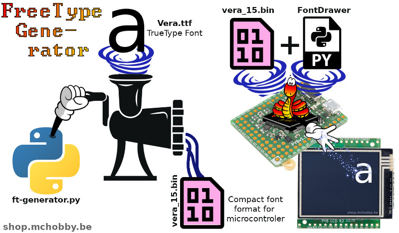

## FreeType Generator
The generator project will load .ttf files and generates font files under (.py and .bin) format.

The .bin files could be copied to the MicroPython board and then be used with MicroPython code to draw font-based text.

The .py file are intermediate file that can be used for inspection and better understanding of the the font internals. This file can be loaded into a Python 3 as well as a MicroPython session. This file format imply a big parsing overhead under MicroPython, the raison why we now use binary format!

See the __Files__ section here under for more details about the font file organization, their compilation to python and binary format.

## FontDrawer

The font drawer is a MicroPython code that uses a .bin font file to draw characters inside the MicroPython FrameBuffer of a screen.

The binary .bin format is quicly loaded inside the microcontroler memory with minimal impact on the micropython parser!

The `fdrawer.py` library and desired font (.bin files, EG: `vera.m15.bin`) must be copied to the MicroPython board.

The following [`test_basic.py`](micropython/examples/test_basic) example shows how to draw a character and a string.

``` python
from machine import I2C
from SSD1306 import SSD1306_I2C
from fdrawer import FontDrawer


i2c = I2C( 1, freq=2000000 )
lcd = SSD1306_I2C( width=128, height=64, i2c=i2c, addr=0x3c, external_vcc=True )

# Normal FrameBuffer operation
lcd.rect( 0, 0, 128, 64, 1 )
lcd.show()

# Use a font drawer to draw font to FrameBuffer
fd = FontDrawer( frame_buffer=lcd, font_name = 'vera_m15' )
fd.print_str( "Font Demo", 2, 2 )
fd.print_char( "#", 100, 2 )
fd.print_str( fd.font_name, 2, 18 )

# Send the FrameBuffer content to the LCD
lcd.show()
```
Which produce the following results:


Note:
* the "m" in front of "m15" means that the .bin file only contains a part of the character set.
* An uncoded character is replaced by a squared rectangle (like the space in this example)

__Other examples and dedicated README are availables in the [micropython (Font-Drawer) subfolder](micropython)__

# Files

* __ttf-fonts/__ : This folder contains source font that will be transformed
* __upy-fonts/__ : This folder contains the microPython font file generated (*.py & *.bin files). Binary file format is described in the [tech_info.md](tech_info.md) .
* __generate-all-font.sh__ : Use the ```ft-generate.py``` to generates all the ILI9341 inside ```ili-fonts/``` from FreeType font available in ```ttf-font/```
* __ft-generator.py__ : script with arguments generating ILI-driver fonts (see the .sh file for sample, please read the ili-fonts.md for more information on applicable naming conventions).
* __ft-view.py__ : debugging tool. Allow to view a character bitmap encoding (or the whole font set). __calculate the max size (height,width) of the font__. The file [`ft-view-for-vera.txt`](ft-view-for-vera.txt) shows the generated content... which is very interesting to learn.
* __ft-view-encoded.py__ : same as ft-view.py but also showing the encoded data (useful for bug tracking)

Somes of the fonts availables in the [upy-fonts](upy-fonts) folder:

__arrow_15__

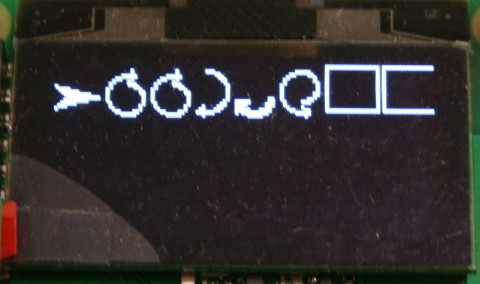

__arrow_23__

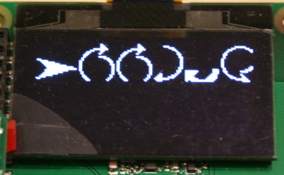

__etypo_13__

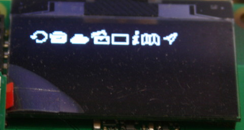

__etypo_23__

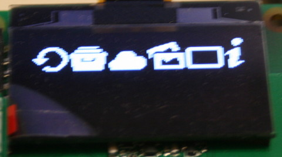

__heyd_23__

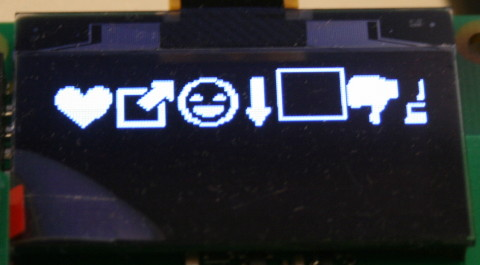

__pitch_15__

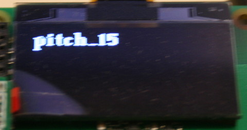

__pitch_23__

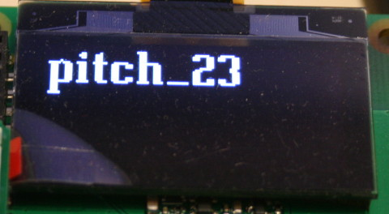

__vera_10__

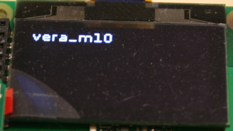

__vera_23__

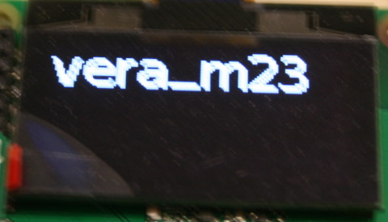

__veram_15 (VeraMono)__

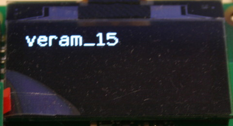

__veram_23 (VeraMono)__

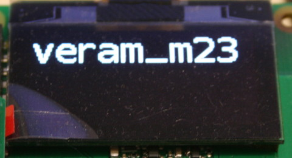

# Install instructions

The font generator "ft-generator.py" is a Python 3 script with some dependencies.
You will need to install the dependencies prior to use them.

```
pip3 install freetype-py
pip3 install docopt
```

## FreeType and library installation on non Linux machines
FreeType library should be available aout-of-the box on most of the Linux systems (As Linux Mint, Ubuntu and Debian).

For windows, you will certainly run into a '''dll nightmare'''. Finding the good DLL version properly compiled for win32/win64 was a lonnnnnnggggg path to go.

Here some path to find the good Windows DLL. Better use Linux!

```
*** DLL Nightmare on Windows ***

http://www.freetype.org/

Win32 installation can be found here
http://gnuwin32.sourceforge.net/packages/freetype.htm
```

# Resources

## Technical details

* [tech_info.md](tech_info.md) - describing the binary format for font.

## FreeType

* [Monochrome font rendering with FreeType and Python](https://dbader.org/blog/monochrome-font-rendering-with-freetype-and-python)
* [FreeType GitHub project](https://github.com/rougier/freetype-py)

## DocOpt - argument parser

La plus belle manière de parser les arguments de script en python

* [docopt.org](http://docopt.org)
* [La plus belle maniere de parser les arguments de script en python](http://sametmax.com/la-plus-belle-maniere-de-parser-les-arguments-de-script-en-python/) sur Sam-et-Max (attention, gros écarts de langage).

## About font
* [A Crash Course in Typography: The Basics of Type](http://www.noupe.com/essentials/icons-fonts/a-crash-course-in-typography-the-basics-of-type.html) noupe.com
* [Font Kerning](https://en.wikipedia.org/wiki/Kerning) Wikipedia
* [Glyph Metrics](http://www.freetype.org/freetype2/docs/tutorial/step2.html) Freetype.org

## Roman Podgaiski ILI9341 driver
This project was initially written to support the ILI9341 driver from  Roman Podgaiski.
Later the project were improved to be used with any FrameBuffer based screen display.

The ILI9341 driver is developed by Roman Podgaiski (ropod7) and is available here at [https://github.com/ropod7/pyboard_drive](https://github.com/ropod7/pyboard_drive)

Some French technical information and wiring are available at MCHobby [http://wiki.mchobby.be/index.php?title=MicroPython-ILI9341](http://wiki.mchobby.be/index.php?title=MicroPython-ILI9341)
